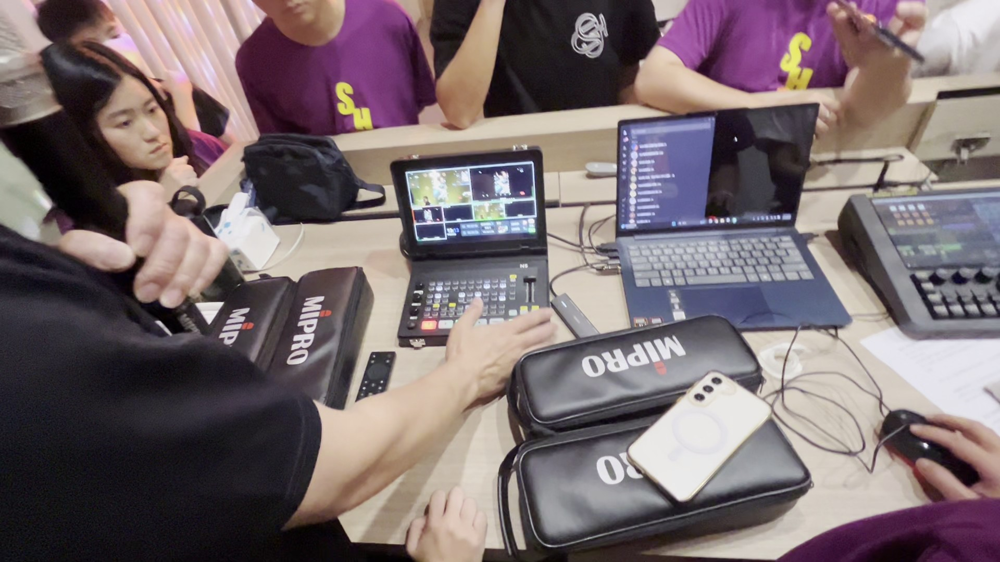
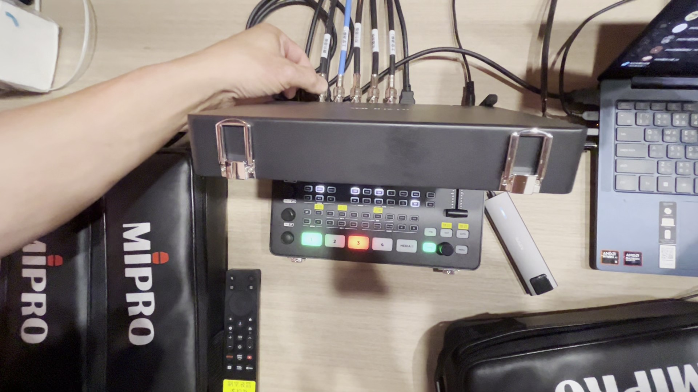
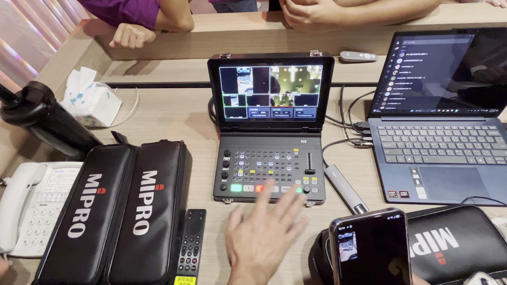
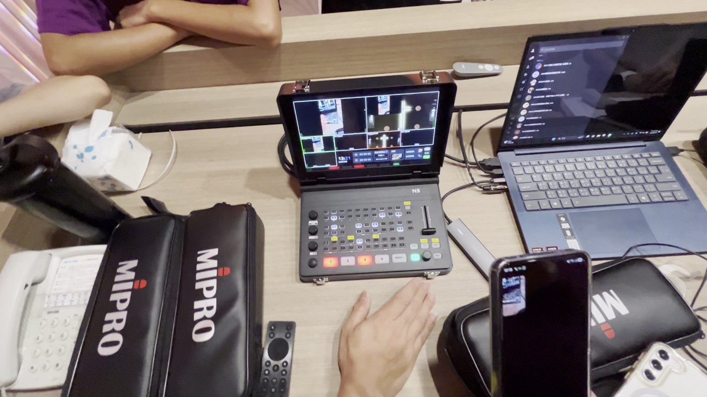
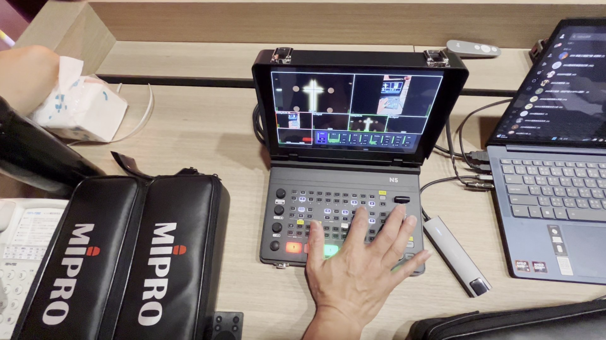
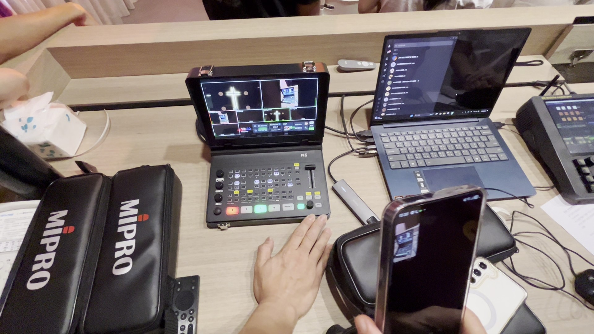
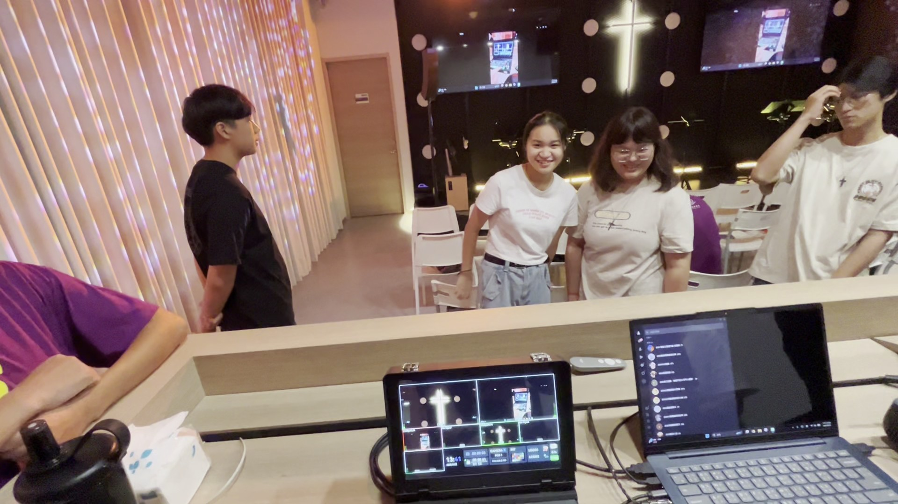

# Sprolink NeoLIVE N5 導播機 — 新手入門逐步圖文教學指南

歡迎使用 **Sprolink NeoLIVE N5** 專業 4 頻道 4K UHD 直播影片切換器！本教學指南專為教會導播同工、青年侍奉人員及影音新手編寫，結合現場實體培訓影片與官方原廠手冊規範，協助您從零開始快速掌握導播機的核心操作與實務技巧。

---

## 目錄
1. [模組一：硬體外觀與介面配置](#模組一硬體外觀與介面配置)
2. [模組二：開機與 Multiview 多畫面監看](#模組二開機與-multiview-多畫面監看)
3. [模組三：畫面切換與轉場操作 (CUT / AUTO / T-Bar / FTB)](#模組三畫面切換與轉場操作)
4. [模組四：雙子母畫面 (PIP) 與 LOGO 疊加](#模組四雙子母畫面-pip-與-logo-疊加)
5. [模組五：專業音訊混音、AFV 與延遲校正](#模組五專業音訊混音afv-與延遲校正)
6. [模組六：PTZ 雲台攝影機操控與 10 組預置位](#模組六ptz-雲台攝影機操控與-10-組預置位)
7. [模組七：場景預設 (SCENE) 與 Super Source 多畫面](#模組七場景預設-scene-與-super-source-多畫面)
8. [模組八：USB/SD 本地錄影與直播推流設定](#模組八usbsd-本地錄影與直播推流設定)

---

## 模組一：硬體外觀與介面配置

Sprolink NeoLIVE N5 採用便攜式手提箱一體成型設計，內建 **10.1 吋高解析 TFT 液晶螢幕**，將導播台、多畫面監看器、混音器與 PTZ 攝影機控制器高度整合。



### 1.1 面板功能區劃分

```
+------------------------------------------------------------------------+
|                      10.1 吋 TFT 液晶監看螢幕                           |
|   [ PVW 預監綠框 ]                       [ PGM 主輸出紅框 ]            |
|   [ IN 1 ]    [ IN 2 ]    [ IN 3 ]    [ IN 4 ]    [ MEDIA 5 / 狀態列 ] |
+------------------------------------------------------------------------+
| (A) 旋鈕控制區      (C) 專業功能矩陣區                   (D) 轉場控制區  |
|  [VOLUME] [DELAY]    [LOGO1] [LOGO2] [BKGD]              |    |       |
|  [HP]     [SPEED]    [PIP1]  [PIP2]  [TRANS]             | T  | [CUT]  |
|  [AE]     [AF]       [AUDIO] [AFV]   [SCENE]             | 推 | [AUTO] |
| (B) 五向搖桿         [DSK]   [STILL] [REC] [STREAM]      | 桿 | [FTB]  |
|                                                          |    | [MODE] |
| (E) 主訊號切換按鈕列                                                    |
|   [  1  ]       [  2  ]       [  3  ]       [  4  ]       [ MEDIA 5 ]  |
+------------------------------------------------------------------------+
```

* **(A) 旋鈕控制區**：
  * `VOLUME`：主輸出總音量（短按一鍵靜音/恢復）。
  * `DELAY`：音訊延遲微調旋鈕（解決嘴型不同步問題）。
  * `HP`：耳機監聽音量與通道選擇。
  * `SPEED / AE / AF`：PTZ 運鏡速度、自動/手動曝光、自動/手動對焦。
* **(B) 五向方向搖桿**：控制 PTZ 攝影機上下俯仰與左右平移，或在選單中微調位置/取色。
* **(C) 專業功能矩陣區**：包含圖層、台標、混音、錄製、推流與色鍵去背等快捷按鈕。
* **(D) 轉場控制區**：手動 T-Bar 推桿、硬切 `CUT`、自動特效切換 `AUTO`、黑場淡化 `FTB`。
* **(E) 主訊號切換列**：5 顆大型 RGB 透光按鍵（對應 4 路 HDMI 輸入 + 1 路第 5 媒體源）。

### 1.2 後面板介面與接線說明



* **HDMI 輸入 (IN 1 ~ IN 4)**：
  * `IN 1` 與 `IN 2`：支援最高 **4K UHD** 訊號輸入（建議連接主講台主攝影機、主堂全景）。
  * `IN 3` 與 `IN 4`：支援 **1080P HD** 訊號輸入（建議連接敬拜團機位、簡報投影電腦 PPT）。
* **HDMI 輸出 (OUT 1 & OUT 2)**：
  * `OUT 1 (PGM)`：主節目輸出，連接至大堂主投影機或副堂液晶電視。
  * `OUT 2 (AUX / Multiview)`：輔助輸出，可設定為外接多畫面監看螢幕或特定機位。
* **UVC 直播輸出接口 (Type-C / USB 3.0)**：
  * 免驅動隨插即用！連接電腦時會被識別為高畫質網路攝影機（相容 OBS、Zoom、Teams、YouTube 直播）。
* **網路接口 (LAN / RJ45)**：
  * 連接教會局域網交換機，用於控制 IP PTZ 攝影機、Web 遠端管理或直接 RTMP 推流。
* **外接音訊輸入 (MIC 1 & MIC 2)**：
  * 3.5mm 音訊輸入孔，可直接接入主堂音響混音台 (Mixer) 的 AUX Out 訊號。
* **耳機監聽孔 (Headphone)**：
  * 3.5mm 音訊輸出孔，供導播同工即時監聽現場混音品質。

---

## 模組二：開機與 Multiview 多畫面監看

### 2.1 開關機作業
1. **開機**：插上電源適配器，短按面板上的 **電源鍵**，螢幕點亮並自動載入系統配置。
2. **關機**：長按電源鍵 3 秒以上，待螢幕提示並完全關閉後方可拔除電源。

### 2.2 Multiview 螢幕介面解析



螢幕預設分為多重視窗：
1. **PVW 視窗 (Preview / 預監，綠色外框)**：
   * 位於螢幕**左上方**。顯示「下一刻準備切換輸出」的待命畫面。
   * 導播應在此視窗確認鏡頭角度、構圖與對焦無誤後，再切入主畫面。
2. **PGM 視窗 (Program / 主輸出，紅色外框)**：
   * 位於螢幕**右上方**。顯示「當前正在對外直播與投影」的正式畫面！
3. **輸入源視窗 (IN 1 ~ IN 4 & MEDIA 5)**：
   * 位於螢幕下方，即時監看各攝影機與媒體播放源。
   * 畫面左上角會自動讀取並顯示輸入解析度（如 `1080P60`、`4K30`）。
4. **即時音量表 (Audio Level Meters)**：
   * 顯示各聲道（CH1~5、MIC1~2、PGM 主輸出）的動態音量電平，綠色為正常安全區（-20dB ~ -6dB），黃色為飽和區，紅色為破音失真區（0dB Overload）。

---

## 模組三：畫面切換與轉場操作

導播的核心任務就是「平穩、流暢地切換不同機位」。NeoLIVE N5 支援業界標準的 PVW/PGM 雙母線操作邏輯。



### 3.1 切換方式一：直切 (Hard Cut)
* **適用時機**：詩歌快歌、講員動作緊湊、需要瞬間精準切換時。
* **操作步驟**：
  1. 在下方按鈕列點選目標機位（如按 `1`，該按鍵變為 **綠燈常亮**，且 PVW 視窗出現該畫面）。
  2. 檢查 PVW 畫面確認無誤。
  3. 按下 **`CUT`** 按鈕，PVW 與 PGM 瞬間對調，目標畫面立即上屏！

### 3.2 切換方式二：自動特效轉場 (Auto Transition)
* **適用時機**：主日講道、崇拜祈禱、詩歌慢歌，營造平緩莊重的氛圍。
* **操作步驟**：
  1. 點選目標機位（亮綠燈）。
  2. 按下 **`TRANSITION`** 按鈕可選擇轉場特效（內建 36 種，如淡入淡出 Dissolve、擦除 Wipe 等）與轉場時間（建議設為 `0.5s` ~ `1.0s`）。
  3. 按下 **`AUTO`** 按鈕，導播機會自動以設定的時間平滑過渡至目標畫面。

### 3.3 切換方式三：手動 T-Bar 推桿
* **適用時機**：同工欲依據詩歌旋律手工控制轉場節奏。
* **操作步驟**：
  1. 點選目標機位（亮綠燈）。
  2. 平穩推動右側的 **T-Bar 推桿**，推到底即完成轉場。

### 3.4 防呆功能：FTB (Fade to Black 淡黑)
* **功能**：一鍵將 PGM 主輸出平滑淡化為純黑畫面。
* **使用場景**：
  * 聚會正式開始前（避免會眾看到測試畫面）。
  * 聚會結束後的主控收尾。
* ⚠️ **重要提醒**：若發現主輸出無畫面且 `FTB` 鍵亮紅燈，代表處於淡黑狀態，**只需再按一次 `FTB` 即可恢復正常顯示！**

---

## 模組四：雙子母畫面 (PIP) 與 LOGO 疊加



### 4.1 雙子母畫面 (PIP 1 / PIP 2) 設定
教會主日最常見的需求為「主畫面為講道 PPT，右下角嵌入講員特寫鏡頭」。

1. **進入 PIP 預監**：按下功能區的 **`PIP 1`** 或 **`PIP 2`** 鍵，再按 **`PVW`**，子畫面將在預監視窗中出現。
2. **調整訊號源與尺寸**：按下 **`SET`** 鍵，螢幕彈出圖層選單：
   * 透過旋鈕選擇子畫面的訊號源（如 `IN 1` 講台攝影機）。
   * 旋轉旋鈕調節子畫面比例縮放（如 `25%` 或 `30%`）及位置座標（X, Y）。
3. **上屏輸出**：確認預監無誤後，按下該圖層的 **`PGM`** 按鈕，子畫面即可同步疊加至主直播畫面中。
4. **關閉 PIP**：再次點擊 **`PGM`** 鍵即可關閉子母畫面。

### 4.2 教會 LOGO / 主題台標疊加
1. **素材準備**：將教會 LOGO（尺寸 960x540，透明背景 PNG 格式）放入隨身碟的 `logos` 資料夾中並插入導播機。
2. **載入與位置微調**：按下 **`LOGO 1`** 或 **`LOGO 2`**，當燈號閃爍時，使用五向搖桿移動 LOGO 位置，旋轉旋鈕進行放大縮小。
3. **推向直播**：點擊 **`ON AIR`** 按鈕，LOGO 即常駐於主畫面上方。

---

## 模組五：專業音訊混音、AFV 與延遲校正

音訊是直播品質的靈魂！NeoLIVE N5 內建 5 路視訊內嵌音訊 + 2 路外接 MIC 輸入。



### 5.1 音訊模式說明：ON vs AFV
* **`ON` (常開模式)**：
  * 無論視訊畫面切換到哪一機位，該通道聲音始終維持輸出。
  * 💡 **教會必設**：連接主控音響 Mixer 的 `MIC 1` 必須設為 **`ON`**，確保講員與敬拜團聲音不中斷！
* **`AFV` (Audio-Follow-Video, 音隨影動)**：
  * 當畫面切換到該訊號時，聲音自動開啟；切走時自動靜音。
  * 💡 **適用場景**：播放第 5 路媒體影片（宣傳片、見證影片）時，設定為 `AFV` 可在影片切出時自動靜音。

### 5.2 解決嘴型不同步：DELAY 音訊延遲旋鈕
* 在大型場地中，視訊經過相機處理可能會有 50~150ms 的延遲，導致「聲音比嘴型快」。
* **調節方式**：旋轉面板上的 **`DELAY`** 旋鈕（順時針增加延遲，逆時針減少），對照現場講員嘴型直到完全同步。

### 5.3 耳機監聽 (HP)
* 旋轉 **`HP`** 旋鈕可切換監聽通道：
  * 預設監聽 `PGM`（會眾與線上直播聽到的最終混音）。
  * 亦可切換至單一輸入源（如 `MIC 1` 或 `CH 4`）進行單獨除錯。

---

## 模組六：PTZ 雲台攝影機操控與 10 組預置位

Sprolink NeoLIVE N5 支援透過網路 IP（Visca over IP / ONVIF）直接控制最多 4 台 PTZ 攝影機，省去額外購買專用攝影機控制鍵盤的成本。



### 6.1 進入 PTZ 控制模式
1. 按下面板上的 **`PTZ`** 按鈕（燈號進入閃爍/啟用狀態）。
2. 旋轉旋鈕選取欲控制的攝影機（CAM 1 ~ CAM 4）。

### 6.2 手動運鏡操作
* **上下仰俯 / 左右平移 (Pan / Tilt)**：推動面板左側的 **五向搖桿**。
* **鏡頭拉近 / 拉遠 (Zoom In / Out)**：點按 LOGO 旁的 **`◄` (廣角) / `►` (望遠)** 方向鍵。
* **速度控制**：旋轉 **`SPEED`** 旋鈕調整雲台轉動快慢（講道特寫宜用慢速 3~5，詩歌動態宜用中速 6~8）。
* **對焦與曝光**：
  * **`AF` 旋鈕**：短按切換「自動對焦 (Auto Focus)」或「手動對焦 (Manual Focus)」。
  * **`AE` 旋鈕**：短按切換「自動曝光」或手動調整光圈/快門。

### 6.3 10 組鏡頭預置位 (Presets) 存取技巧
主日前務必預先儲存好各環節的關鍵機位角度：

| 預置位編號 | 建議配置機位 | 說明 |
| :---: | :--- | :--- |
| **`1`** | **講台特寫 (Pulpit Close-up)** | 牧師講道、主席宣召專用半身景。 |
| **`2`** | **講台全景 (Pulpit Wide)** | 包含講台、十架背景與獻詩席。 |
| **`3`** | **司琴 / 敬拜主領 (Worship Leader)** | 司琴手部特寫或主領特寫。 |
| **`4`** | **敬拜團全景 (Worship Team)** | 詩班、樂團全體畫面。 |
| **`5`** | **會眾席全景 (Sanctuary Congregation)** | 會眾起立敬拜、禱告大景。 |
| **`6`** | **洗禮池 / 聖餐台 (Baptism / Communion)** | 聖餐禮拜或浸禮專用機位。 |

* **儲存預置位 (Save Preset)**：
  * 使用搖桿調好角度與焦距 ➡️ **長按** 數字鍵（如長按 `1`）直到指示燈閃爍確認儲存。
* **叫用預置位 (Recall Preset)**：
  * 在 PTZ 模式下，**短按** 數字鍵（如短按 `1`），攝影機立即自動平滑轉動至該預設角度！

---

## 模組七：場景預設 (SCENE) 與 Super Source 多畫面

### 7.1 一鍵場景切換 (Scene Presets)
* 按下 **`SCENE`** 按鈕進入場景選單，系統提供 12 組原廠預設佈局。
* 導播亦可將常用的圖層、PIP 與背景配置儲存於自訂場景中（長按旋鈕儲存，短按旋鈕叫用）。

### 7.2 Super Source 畫廊模式 (Gallery Mode)
* 支援 **三畫面** 與 **四畫面** 同屏分割（如：講員畫面 + 敬拜團畫面 + PPT 簡報畫面同時播出）。
* 進入 `SCENE` ➡️ `Super Source`，可指定各個分割子畫面 (`SRC1`, `SRC2`, `SRC3`) 分別對應哪一路 HDMI 輸入。

---

## 模組八：USB/SD 本地錄影與直播推流設定

### 8.1 隨身碟 / SD 卡本地高畫質錄影 (REC)
1. **儲存設備格式**：強烈建議使用 **NTFS** 格式之高速隨身碟或 SSD 外接硬碟（讀寫穩定不掉幀）。
2. **開始錄影**：插入設備後，短按面板上的 **`REC`** 鍵，按鍵紅燈亮起，螢幕狀態列顯示錄影進行時間。
3. **停止錄影**：聚會結束時，再次短按 **`REC`** 鍵。
4. ⚠️ **安全拔除守則**：**務必等待 REC 紅燈完全熄滅** 之後，方可將隨身碟拔出！若在寫入中強行拔除，將導致影片檔案損毀無法讀取。

### 8.2 直播推流 (Stream) 兩種方式
* **方式 A：UVC USB 直連電腦 (推薦，最彈性)**
  * 用 Type-C/USB 3.0 線連接導播機與主控電腦。
  * 開啟電腦端 OBS Studio / vMix，新增「視訊擷取裝置」選擇 `NeoLIVE N5`，即可推流至 YouTube / Facebook。
* **方式 B：網口獨立硬體推流 (免電腦推流)**
  * 導播機連接網路線，由 DHCP 取得 IP。
  * 在隨身碟根目錄建立 `stream_url.txt` 文字檔，第一行貼上 RTMP 伺服器網址，第二行貼上串流金鑰 (Stream Key)。
  * 插入導播機載入後，短按面板 **`STREAM`** 鍵即可直接由導播機向外推流！