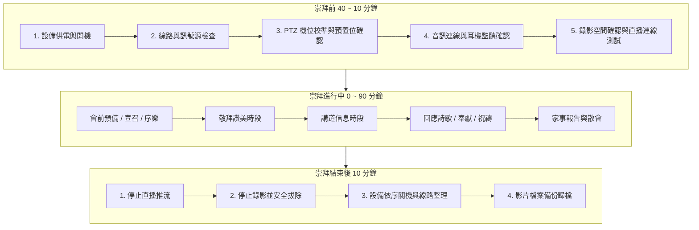

# 主日崇拜導播標準作業程序 (SOP) 手冊

> **本標準作業程序 (Standard Operating Procedure, SOP)** 專為教會主日崇拜、特會及重要聚會之導播事奉同工設計。請同工於服事當日嚴格遵守「會前準備期」、「會中執行期」與「會後收尾期」三大階段之標準流程，確保崇拜影音傳輸流暢、莊重且零失誤。

---

## 流程總覽架構圖

---

## 階段一：會前準備期 (崇拜前 40 ~ 10 分鐘)

### 步驟 1.1：設備供電與開機
1. 開啟主控台總電源延長線開關。
2. 短按 NeoLIVE N5 導播台上的 **電源鍵**，螢幕點亮進入系統。
3. 開啟直播筆電 / 主控電腦，確認網路連線正常（有線網路優先）。
4. 檢查主堂投影機 / 兩側電視牆電源已開啟。

### 步驟 1.2：訊號源與輸入解析度檢查
對照 NeoLIVE N5 螢幕下方分割視窗，逐一確認 5 路輸入訊號：
* `IN 1`：**主講台 PTZ 攝影機 1**（確認十字架/講員構圖，顯示 `1080P60` 或 `4K30`）。
* `IN 2`：**主堂全景攝影機 2**（確認會眾席視角正常）。
* `IN 3`：**敬拜團 / 司琴攝影機 3**（確認樂團與司琴鍵盤畫面）。
* `IN 4`：**投影簡報電腦 (PPT / ProPresenter)**（確認詩歌投影畫面正常輸入）。
* `MEDIA 5`：**隨身碟媒體源**（確認開場宣傳短片或背景圖片已載入）。

### 步驟 1.3：PTZ 攝影機預置位 (Preset) 校準
1. 按下 **`PTZ`** 按鈕進入攝影機控制模式。
2. 逐一短按數字鍵 `1` ~ `5`，測試各鏡頭預置位轉向是否精準：
   * `[1]` 講台特寫 ➡️ 檢查講員站立高度與頭頂保留空間 (Headroom)。
   * `[2]` 講台全景 ➡️ 檢查十字架與講台兩側是否置中水平。
   * `[3]` 司琴 / 敬拜主領 ➡️ 檢查主領特寫。
   * `[4]` 敬拜團全景 ➡️ 檢查詩班與樂手全體入鏡。
   * `[5]` 會眾席全景 ➡️ 檢查大堂會眾視野。
3. 若有偏差，推動 **五向搖桿** 與 **`◄` / `►` 縮放鍵** 調整到位後，**長按** 對應數字鍵覆蓋儲存。

### 步骤 1.4：音訊輸入與耳機監聽 (Audio Check)
1. 戴上監聽耳機，旋轉 **`HP`** 旋鈕確認音量舒適。
2. 按下 **`AUDIO`** 鍵檢查各聲道狀態：
   * `MIC 1` (大堂音響 Mixer 總輸出)：務必設為 **`ON` (常開)**，電平保持在綠色區間 (-18dB ~ -6dB)。
   * `IN 1` ~ `IN 4` (攝影機/電腦音訊)：預設設為 **`OFF`**（除非播放電腦影片聲音才開啟 `IN 4` 的 `AFV`）。
3. 請敬拜團試音時，旋轉 **`DELAY`** 旋鈕對齊嘴型與聲音，確保影音完全同步。

### 步驟 1.5：錄影隨身碟與直播連線測試 (前 15 分鐘)
1. 插入 NTFS 格式之高速 USB 隨身碟，確認螢幕狀態列顯示隨身碟容量（如 `總共: 128GB`）。
2. 在崇拜開始前 10 分鐘，短按 **`STREAM`** 啟動直播推流（或在電腦端 OBS 點擊「開始串流」）。
3. 導播將 PGM 切換至開場靜態圖 (GFX) 或開場詩歌背景。

---

## 階段二：會中執行期 (崇拜進行各環節切換準則)

### 環節 1：宣召 / 序樂 / 詩歌敬拜 (Worship & Praise)
* **主切換原則**：
  * **主領開口唱詩** ➡️ 切至 **[機位 3: 敬拜主領特寫]** 或 **[機位 4: 敬拜團全景]**。
  * **全體會眾開口齊唱 / 高潮副歌** ➡️ 切至 **[機位 5: 會眾全景]** 或 **[機位 2: 講台大景]**。
  * **歌詞更換** ➡️ 可短暫切至 **[IN 4: PPT 歌詞全螢幕]** 或開啟 **[PIP 子母畫面]**。
* **運鏡與轉場守則**：
  * 慢歌使用 **`AUTO` (平滑淡化，1.0s)**。
  * 快歌、律動歌曲可使用 **`CUT` (直切)** 配合節拍切換。
  * ⚠️ **嚴禁**在機位處於 PGM (直播中) 時推動搖桿進行大幅度晃動或調整！**必須在 PVW (預監) 調好角度後才切換上屏！**

### 環節 2：主日講道信息 (Sermon)
* **畫面配置策略**：
  * **牧師宣講 / 讀經** ➡️ **[機位 1: 講台半身特寫]** 為主要畫面（佔 70% 時間）。
  * **牧師提到投影片重點 / 講章經文** ➡️ 立即切換為 **[雙畫面 PIP 模式]**（大畫面為 PPT 經文投影片，右下角為講員特寫）。
  * **大段經文閱讀** ➡️ 短暫全螢幕切入 **[IN 4: PPT 簡報]**，讀畢後切回講員特寫。
* **切換節奏**：
  * 講道時切換頻率不宜過高（建議每 30 秒至 1 分鐘切換一次），維持視覺專注穩定。

### 環節 3：回應詩歌 / 奉獻 / 祝禱 (Response & Benediction)
* **奉獻報告** ➡️ 切入奉獻資訊投影片 (PPT) 或司獻人員中景。
* **牧師祝禱** ➡️ 祝禱開始時切至 **[機位 1: 講台特寫]**，牧師舉手祝禱時切至 **[機位 2: 講台十字架全景]**，莊重神聖。
* **阿們頌 / 殿樂** ➡️ 切至 **[機位 5: 會眾散會全景]**。

---

## 階段三：會後收尾期 (崇拜結束後 10 分鐘)

### 步驟 3.1：停止直播推流
1. 祝禱結束並播放散會音樂約 1~2 分鐘後，切入結束圖卡（如「祝您平安」、「下週見」）。
2. 短按導播台上的 **`STREAM`** 鍵停止推流（或在電腦端 OBS 點擊「停止串流」）。

### 步驟 3.2：安全停止錄影 (⚠️ 最關鍵安全步驟)
1. 短按面板上的 **`REC`** 鍵停止錄製。
2. **⚠️ 嚴格注意**：此時系統正在將快取資料寫入隨身碟，**必須注視面板上的 REC 燈號，直到紅燈「完全熄滅」**，才可拔除隨身碟！
3. 若 REC 燈亮時拔出，將導致整場崇拜錄影檔案毀損不可恢復！

### 步驟 3.3：設備關機與復歸
1. 長按導播台 **電源鍵 3 秒** 正常關機。
2. 關閉電腦、投影機、電視牆與外接周邊。
3. 將所有 HDMI 線、音訊線、電源線整齊收卷歸位。
4. 蓋上導播機防塵上蓋，妥善扣上安全鎖扣。